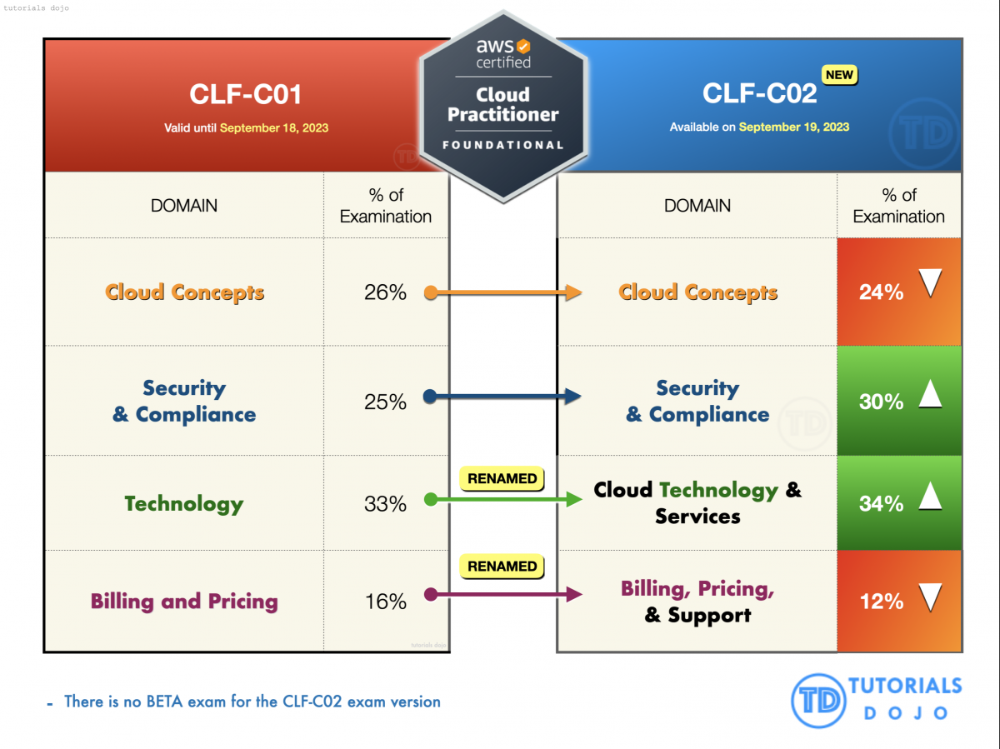

# Challenge Cloud Practitioner

### Objetivo del Challenge:
El AWS Cloud Practitioner Challenge es una iniciativa de AWS User Group Medellín diseñado para ayudar a los entusiastas de la nube a prepararse para la certificación AWS Certified Cloud Practitioner (CLF-C02).
**(NOTA: Es apto para todos los niveles)**
### Dominios de enfoque del examen:

### Contenido de las sesiones:
El repositorio tiene una carpeta por charla, donde estará toda la información correspondiente:

1. Introducción a la Nube y AWS.
2. Identidad y Seguridad en AWS.
3. Servicios de Cómputo.
4. Almacenamiento en AWS.
5. Bases de Datos en AWS.
6. Redes y Entrega de Contenido.
7. Monitoreo y Gestión de Recursos.
8. Facturación y Precios en AWS.
9. Herramientas de Automatización y DevOps.
10. Práctica con Preguntas de Examen y Repaso Final.

### Patrocinadores:
- AWS
- Rootstack
- O'Reilly

### Referencias y documentación usada:
- [Información del examen en la página oficial de AWS](https://aws.amazon.com/es/certification/certified-cloud-practitioner/ "Información del examen en la página oficial de AWS")
- [Guía oficial del examen](https://d1.awsstatic.com/es_ES/training-and-certification/docs-cloud-practitioner/AWS-Certified-Cloud-Practitioner_Exam-Guide.pdf "Guía oficial del examen")
- [AWS Cloud Practitioner Essentials Course](https://explore.skillbuilder.aws/learn/courses/134/aws-cloud-practitioner-essentials/lessons/136404/aws-cloud-practitioner-essentials "AWS Cloud Practitioner Essentials Course")
- [AWS Cloud Practitioner Essentials Course en Español](https://explore.skillbuilder.aws/learn/courses/10455/aws-cloud-practitioner-essentials-espanol-de-espana/lessons/142384/fundamentos-de-la-nube-de-aws-para-profesionales "AWS Cloud Practitioner Essentials Course en Español")
- [Cloud quest](https://explore.skillbuilder.aws/learn/courses/11458/aws-cloud-quest-cloud-practitioner "Cloud quest")
- [AWS Well Architected Framework](https://docs.aws.amazon.com/es_es/wellarchitected/latest/framework/welcome.html "AWS Well Architected Framework")

> **Nota:** La información aquí es tomada de documentación oficial, y de información en internet.
> Este repositorio es una recopilación de las charlas que daremos en el Cloud Practitioner Challenge hecho por la comunidad** AWS User Group Medellín**.
> - [Redes sociales de la comunidad AWS User Group Medellín](https://linktr.ee/awsugmed "Redes sociales de la comunidad AWS User Group Medellín")
> - [Link de las sesiones en Youtube](https://www.youtube.com/playlist?list=PLhbdvasxz8wwO-b9nlRBYYzY6n5CvSOvj "Link de las sesiones en Youtube")

## Disclaimer

- This repository is NOT an official AWS Repository, it's built and maintained by the AWS User Group Medellín Community members by open source projects and documents.

## Special Thanks! 🙏

- [Santiago Bedoya](https://github.com/Santiago1023) and [Cristian Pavony](https://www.instagram.com/cpavony) for their invaluable support to the AWS Community!
